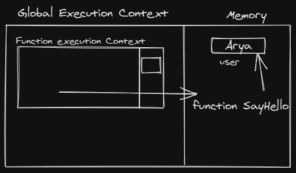
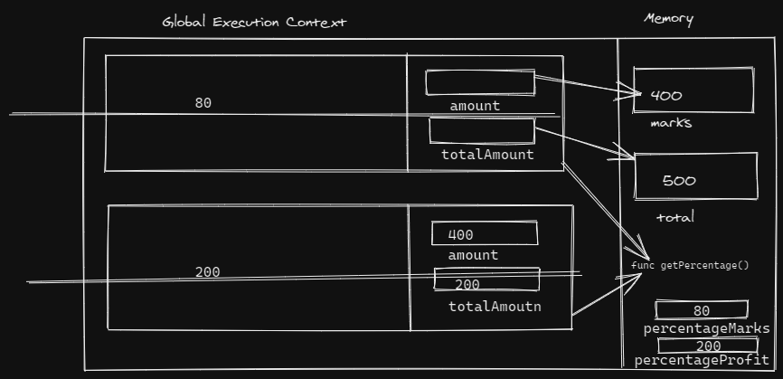
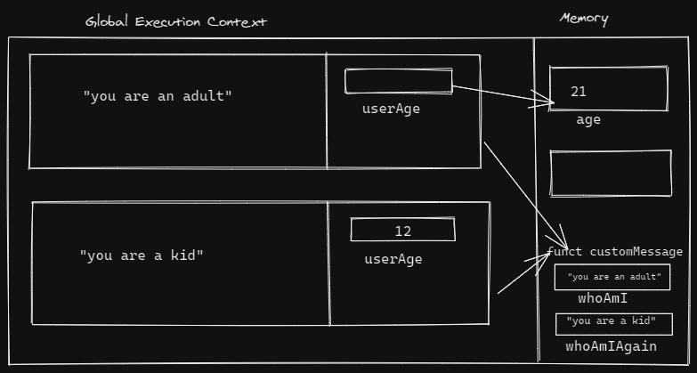

1. What does thread of execution means in JavaScript?
 JS Engine goes through a piece of code line by line, it is known as Thread of Execution.

2. Where the JavaScript code gets executed?
  Inside Global Execution Context

3. What does context means in Global Execution Context?
 It is an abstract concept of environment where JavaScript code gets executed.

4. When do you create a global execution context.
Whenever a JavaScript file gets loaded in memory , GEC gets created.

5. Execution context consists of what all things?
It contains the a vairable object , scope chain and thisBinding.

6. What are the different types of execution context?
Global Execution Context and Function Execution Context

7. When global and function execution context gets created?
Whenever a JavaScript file gets loaded in memory , GEC gets created and whenever a function is called its execution context is created.

8. Function execution gets created during function execution or while declaring a function.
Function Execution context gets created during function execution.


9. Create a execution context diagram of the following code on your notebook. Take a screenshot/photo and store it in the folder named `img`. Use `` to display it here.


```js
var user = "Arya";

function sayHello(){
  return `Hello ${user}`;
}

var userMsg = sayHello(user);
```

<!-- Put your image here -->




```js
var marks = 400;
var total = 500;

function getPercentage(amount, totalAmount){
  return (amount * 100) / totalAmount;
}

var percentageMarks = getPercentage(marks, total);
var percentageProfit = getPercentage(400, 200);
```

<!-- Put your image here -->




```js
var age = 21;

function customeMessage(userAge){
  if(userAge > 18){
    return `You are an adult`;
  }else {
    return `You are a kid`;
  }
}

var whoAmI = customeMessage(age);
var whoAmIAgain = customeMessage(12);
```

<!-- Put your image here -->

