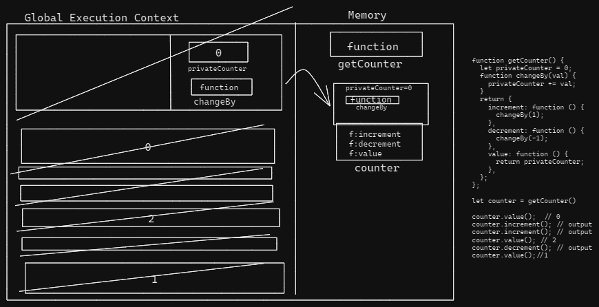
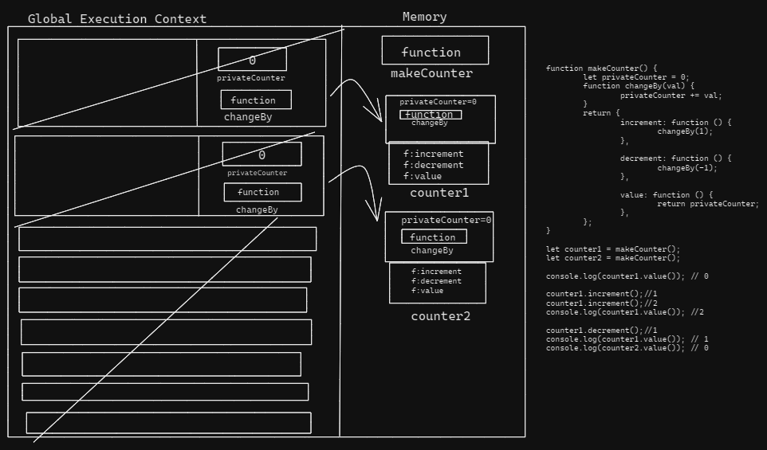

Create the execution context diagram for following code. What will be the output in each line of code

```js
function getCounter() {
	let privateCounter = 0;
	function changeBy(val) {
		privateCounter += val;
	}
	return {
		increment: function () {
			changeBy(1);
		},
		decrement: function () {
			changeBy(-1);
		},
		value: function () {
			return privateCounter;
		},
	};
}

let counter = getCounter();

counter.value(); // output
counter.increment(); // output
counter.increment(); // output
counter.value(); // output
counter.decrement(); // output
counter.value(); // output
```


2. Create the execution context diagram and write the output.

```js
function makeCounter() {
	let privateCounter = 0;
	function changeBy(val) {
		privateCounter += val;
	}
	return {
		increment: function () {
			changeBy(1);
		},

		decrement: function () {
			changeBy(-1);
		},

		value: function () {
			return privateCounter;
		},
	};
}

let counter1 = makeCounter();
let counter2 = makeCounter();

console.log(counter1.value()); //0

counter1.increment();
counter1.increment();
console.log(counter1.value()); // 2

counter1.decrement();
console.log(counter1.value()); // 1
console.log(counter2.value()); // 0
```
